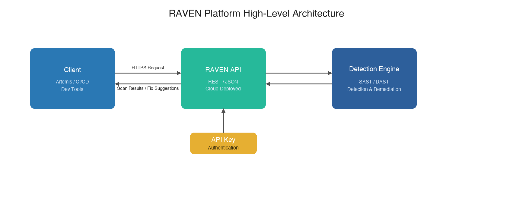

Overview
========

**RAVEN** (Reasoning Agent for Vulnerability ExaminatioN) is an AI-driven platform for
automated code vulnerability detection and remediation. It analyzes source code to identify
security vulnerabilities, generates actionable fix suggestions, and supports interactive Q&A
on scan results.

Architecture
------------

Supported Languages
-------------------

.. list-table::
   :header-rows: 1
   :widths: 30 20 50

   * - Language
     - SAST
     - DAST
   * - C / C++
     - Supported
     - Supported
   * - Java
     - Supported
     - On roadmap
   * - Python
     - Supported
     - On roadmap
   * - Go
     - Supported
     - On roadmap
   * - JavaScript / TypeScript
     - Supported
     - On roadmap
   * - Rust
     - Supported
     - On roadmap
   * - Ruby
     - Supported
     - On roadmap
   * - PHP
     - Supported
     - On roadmap
   * - Kotlin
     - Supported
     - On roadmap
   * - Swift
     - Supported
     - On roadmap

.. note::

   SAST mode leverages built-in rule-based static analysis engines that support a wide
   range of languages out of the box. DAST mode uses LLM-powered deep semantic analysis
   and currently supports C/C++ only, with more languages on the roadmap.

Scan Modes
----------

RAVEN offers two scan modes:

.. list-table::
   :header-rows: 1
   :widths: 15 45 20 20

   * - Mode
     - Description
     - Speed
     - Availability
   * - **SAST** (``"sast"``)
     - Rule-based static analysis combined with LLM reasoning for triage and explanation
     - Seconds to minutes
     - All scan endpoints
   * - **DAST** (``"dast"``)
     - LLM-powered deep semantic analysis with larger context and stronger reasoning capabilities
     - Minutes to hours
     - Project-level scans only

SAST mode uses established rule-based engines for fast pattern matching, with LLM-assisted
triage to reduce false positives. DAST mode performs deeper cross-file semantic analysis
powered entirely by large language models.

Endpoint Summary
----------------

.. list-table::
   :header-rows: 1
   :widths: 22 8 30 15 25

   * - Endpoint
     - Method
     - Description
     - Uses AI
     - Typical Response Time
   * - ``/api/scan/snippet``
     - POST
     - Scan a code snippet (SAST)
     - Yes (LLM)
     - 2--10 seconds
   * - ``/api/scan/files``
     - POST
     - Scan uploaded source files (SAST)
     - Yes (LLM)
     - 5--30 seconds per file
   * - ``/api/scan/project``
     - POST
     - Scan a project archive (.zip)
     - Yes (LLM)
     - SAST: 3--10 min; DAST: 1--5 hours
   * - ``/api/scan/rules``
     - POST
     - Rule-based scan only (no LLM)
     - No
     - 2--30 seconds
   * - ``/api/fix``
     - POST
     - Generate vulnerability fix suggestions
     - Yes (LLM)
     - 10--30 seconds per file
   * - ``/api/followup``
     - POST
     - Follow-up Q&A on scan results
     - Yes (LLM)
     - 5--15 seconds per question
   * - ``/api/healthz``
     - GET
     - Health check
     - No
     - Instant

Deployment
----------

RAVEN is deployed as a cloud REST API, authenticated via API Key. See
:doc:`authentication` for details on how to authenticate your requests.

**AI API Usage:** RAVEN's core analysis capabilities call large language models, including
models from Anthropic, Google, and OpenAI. The system automatically selects the appropriate
model based on the task. Callers do not need to provide their own API keys.
